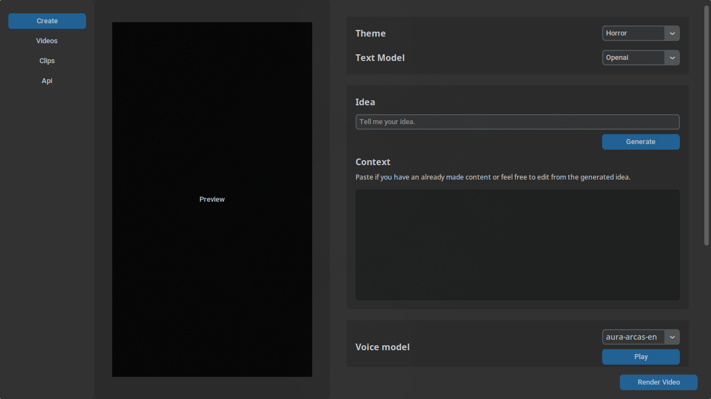

# VidGen
A tool for automating video creation of Reddit-style stories with Minecraft parkour.
|  | Generate this type of videos automatically. |
|---|---|

## Table of contents
- [Introduction](#introduction)
- [Usage](#usage)
- [How to set up](#how-to-set-up)
- [How to use](#how-to-use)

## Introduction
Vidgen was developed using Python. The video generation process is handled by the Python library `MoviePy`, alongside the image processing library `Pillow` for text calculation. Using AI or stories from Reddit, you can generate videos with Minecraft parkour in the background. These background clips are easy to download because the project is equipped with `yt-dlp` for fetching YouTube videos directly through the user interface. Sample links are also available in the clips section for quick access.


## Usage
**TL;DR**:
- Clone repo
- install requirements
- run program `main.py`
- go to api section
- register and input api key on chosen api service (gemini, deepinfra, openai)
- go to deepgram and register then get their api key
- click `save` button
- optional: If you want to upload automatically on facebook, put your facebook api token and facebook page id from facebook developer.
- make sure your facebook app is deployed as live in order for your videos to show on public.
  
**Detailed instructions**
1. Clone this repository
```
git clone https://github.com/sarrtle/vidgen
```
2. If you are using uv:
```
uv add -r requirements.txt
```
If you are using standard pip, create a virtual environment (optional)
```
pip install -r requirements.txt
```
3. Once requirements are installed, run it normally like `uv run main.py` or `python main.py`. A user interface will immerge and you are ready to use it.

## How to set up
1. Go to Api section
2. Choose what api service you are going to use, gemini (free), deepinfra, or openai.

| Api service | Cost          | Link                                 |
| ----------- | ------------- | ------------------------------------ |
| Gemini      | Free and Paid | [gemini](https://deepmind.google/technologies/gemini/)         |
| Deepinfra   | Paid          | [deepinfra](https://deepinfra.com) |
| Openai      | Paid          | [openai](https://platform.openai.com/docs/overview)    |

3. Select your model and enter your api token
4. After that, go to [deepgram](https://www.deepgram.com). Deepgram is a TTS and STT service, used by this project for generating voice and transcribing audio. Create an account for free and get their API key. Then put the api key inside deepgram section on the user interface.

| Api service | Cost          | Link                                 |
| ----------- | ------------- | -----------------------------------  |
| Deepgram    | Free and paid | [deepgram](https://www.deepgram.com) |

5. Don't forget to scroll down and click the `save` button
6. If you want to upload automatically on Facebook. You need these steps:
  - Login to your facebook account that has a facebook page that you are going to use
  - Go to facebook developer
  - Create an app
  - Go to tools on graph api explorer.
    - Select your created app
    - apply the `page_manage_post`, `page_show_list`, `page_manage_engagement` permission.
    - open user or page select menu and choose your page
    - it will generate the token above and copy the access token
> [!Warning]
> In order for your videos to be visible on public, you need to deploy your app live on facebook developer dashboard.

## How to use
After setting up your api keys and chosen services and model.
- Go to story section
- Choose the service you just set up
- Choose theme `facts`, `horror`
- Generate from IDEA to use AI creating a story
- Choose your voice model, click play to check the voice
- apply text font, you can also add your own text font by putting it on `assets/fonts/`
- Apply your video properties, `color`, `style`
- Browse a clip from clip folder, if you have no clip, you can download a sample clip in clip section.
- After you have a clip, you can click render now and it will process the video automatically.
- Once done, you can use the video to upload in social media like `facebook`.
